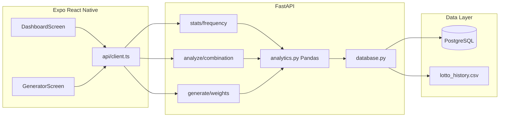

# 로또 분석기 — 아키텍처 및 설계서

> 프로덕션 레벨 풀스택 구조: **Expo (RN+TS)** ↔ **FastAPI+Pandas** ↔ **PostgreSQL / CSV**

---

## [1] 시스템 아키텍처



### 데이터 적재 우선순위

1. **PostgreSQL** (`DATABASE_URL` 연결 성공 시 `lotto_history` 조회)
2. **CSV** (`backend/data/lotto_history.csv`) — 크롤 스크립트 적재
3. **Mock** — 개발·데모용 결정론적 200회차

### UI/UX 디자인 토큰

| 용도 | 값 |
|------|-----|
| 배경 | `#1A1D21` 다크 그레이 |
| 카드 | `#23272E` |
| 본문 텍스트 | `#F5F5F5` / 보조 `#9AA0A6` |
| 포인트(볼·차트만) | 노랑·파랑·빨강·그레이·초록 (`theme/colors.ts`) |

한국 로또 공식 볼 색상: 1–10 노랑, 11–20 파랑, 21–30 빨강, 31–40 회색, 41–45 초록.

---

## [1] 데이터베이스 스키마

DDL: `backend/sql/schema.sql`

### `lotto_history` (마스터)

| 컬럼 | 타입 | 설명 |
|------|------|------|
| `round` | INTEGER PK | 회차 |
| `draw_date` | DATE | 추첨일 |
| `num1`…`num6` | SMALLINT | 당첨번호 (1–45, 서로 상이) |
| `bonus` | SMALLINT | 보너스 |
| `first_prize_amount` | BIGINT | 1등 1게임당 금액(원) |
| `first_winner_count` | INTEGER | 1등 당첨자 수 |

### 성능 인덱스

- `idx_lotto_round_desc` — 최근 N회 `ORDER BY round DESC`
- `idx_lotto_draw_date` — 기간 필터
- `lotto_draw_numbers` 롱 테이블 + `idx_draw_numbers_number` — 번호별 빈도 집계 가속

INSERT/UPDATE 시 트리거 `trg_sync_draw_numbers`가 롱 테이블을 자동 동기화합니다.

---

## [2] 백엔드 API 계약

| 메서드 | 경로 | 핵심 로직 |
|--------|------|-----------|
| GET | `/api/v1/stats/frequency?recent_n=` | `calc_frequency()` — 1~45 빈도·비율 |
| POST | `/api/v1/analyze/combination` | `analyze_combination()` — 홀짝·총합 구간·연속쌍 |
| GET | `/api/v1/generate/weights` | `build_weights()` + `generate_weighted_sets()` — 최근 N회 미출현 +15% |

### 가중치 알고리즘 (요구사항 3)

```
base[n] = (역대 출현 빈도 + 1) 정규화
multiplier[n] = 1.15  (최근 lookback 회차 미출현)
              = 1.0   (그 외)
weight[n] = base[n] × multiplier[n]  → 합=1 확률분포
6개 번호 = np.random.choice(45, 6, replace=False, p=weight)
```

구현: `backend/app/analytics.py`, 설정: `UNSEEN_WEIGHT_BONUS=0.15`, `UNSEEN_LOOKBACK_DRAWS=5`.

---

## [3] 프론트엔드 화면

| 화면 | 파일 | 역할 |
|------|------|------|
| 대시보드 | `DashboardScreen.tsx` | 최신 당첨 `LottoBall` + `OddEvenBar` |
| 번호 생성 | `GeneratorScreen.tsx` | 필터 + `/generate/weights` + 페이드인 |

공통 컴포넌트: `LottoBall`, `OddEvenBar`, `theme/colors.ts`.

---

## 확장 API (운영용)

- `GET /api/v1/history/latest` — 최신 회차
- `GET /api/v1/meta` — 데이터 커버리지
- `GET /api/v1/recommend/round` — 호기 패턴 5게임 (선택 기능)

기획서 필수 3 API 외 확장은 `main.py` 라우터 등록으로 분리되어 있습니다.
